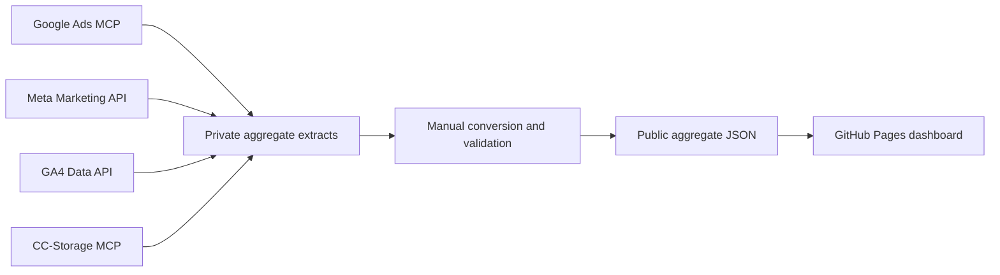

# Data, connections and operations

This guide describes the September 10, 2026 implementation. The cutoff is September 9. For status and ownership context, read [Phase 1 completion](PHASE_1_COMPLETE.md) and [Claude handover](CLAUDE_HANDOVER.md).

## Connections and architecture



| Source | Phase 1 read method | Authentication | Public output |
| --- | --- | --- | --- |
| Google Ads | Google Ads MCP; bounded account, campaign, ad-group and geography reports | Authorized connector outside browser | `google-ads.json` and overlapping Overview totals |
| Meta Ads | Direct Meta Marketing/Graph API, version used v25.0; paginated insights | Protected existing system-user credential in private environment | `meta.json` and matching Overview totals |
| Google Analytics | Direct GA4 Data API; Analytics Admin API for stream verification | Authorized Google Application Default Credentials in private environment | `analytics.json` |
| CCStorage | CC-Storage MCP; read-only monthly operational aggregates | Authorized connector outside browser | Overview facility aggregates and separate private workbook |

The GA4 website stream is `G-TCSG6BY1KK`. Analytics Admin access was enabled on the existing reporting project to verify its identity; site tags, event definitions and tracking configuration were not changed. Private account/property identifiers, credential contents and raw query evidence belong in protected operational context, not these public documents.

The browser fetches four JSON snapshots. It has no source credentials or source API calls. Source connectivity verified during extraction does not mean live data in the dashboard or permanently valid authorization.

## Public dataset contracts

| File | Schema | Grain and content |
| --- | --- | --- |
| `data/reporting.json` | `storage-signal.reporting.v1` | Four periods; Google/Meta account aggregates; 39-facility CCStorage roster per period; timestamps and alternate reporting-view volume |
| `data/google-ads.json` | `storage-signal.ads-details.v1` | Monthly/YTD periods, independent account totals, campaign/ad-group/city rows, rates, geography coverage and reconciliation |
| `data/analytics.json` | `storage-signal.analytics.v1` | Monthly/direct-YTD summaries and dimensions, daily-coverage result, stream context and sampling/threshold/pagination notes |
| `data/meta.json` | `storage-signal.meta.v1` | Monthly hierarchy, ad-set-level dimension reports, adjacent seven-day windows and deterministic insight text |

Campaign/ad identifiers in existing public files identify reporting entities, not customers. Do not introduce visitor, lead or customer records, credentials or private source payloads during future refreshes. Current-snapshot sanitization does not establish that Git history has been purged; the private handover tracks historical-content review separately.

## Metric contracts

### CCStorage

| Metric | Definition | Interpretation rule |
| --- | --- | --- |
| Gross recorded payments | Original eligible amounts assigned to effective payment month | Register measure, not audited revenue or bank settlement |
| Refund adjustments | Current refunds assigned back to original payment month | Later refunds can revise earlier months |
| Net recorded payments | Eligible gross minus current refunds | Per-facility `gross - refunds = net` |
| Eligible payments | Complete, Manually Entered, Partially Refunded and Refunded payment count | Declined, Void and Pending Approval excluded |
| Move-ins / move-outs | Current non-void leases by respective event date | Lease events, not distinct customers; successful query with no event is zero |
| Occupied leases / units | Snapshot at month end or September 9 for MTD | Missing historical snapshot is unavailable |
| Occupancy | Occupied leases divided by storage units | Unit-weighted over available snapshots; never average facility percentages |
| Autopay leases | Source count at occupancy snapshot | Not payment-method share or collection-success rate |

Every current-roster facility remains represented even when earlier payment/occupancy history is missing. Missing history is null, not zero. Counts exceeding capacity are flagged, not capped. Percentage comparisons are suppressed when facilities with data differ. September MTD is not compared with a full prior month.

The separate CCStorage reporting view is disclosed for the full portfolio even when a facility filter is active. It is not the dashboard payment basis:

| Period | Register net | Separate reporting-view volume |
| --- | ---: | ---: |
| June | $374,747.87 | $347,120.79 |
| July | $425,911.92 | $398,203.33 |
| August | $467,763.25 | $432,019.05 |
| September 1–9 | $324,306.85 | $315,980.42 |

The cause of these differences remains unresolved. Do not substitute the series or describe either as bank reconciliation.

### Google Ads

- Source measures are cost in micros, impressions, clicks and reported conversions. Retain micros until display; dollars are `costMicros / 1,000,000`.
- CTR is clicks/impressions; CPC is spend/clicks; cost per conversion is spend/conversions. Undefined denominators produce null.
- Conversions can be fractional. Preserve precision. Campaign/ad-group and independent account delivery reconcile exactly; the validator requires conversion differences below 0.005. A permitted source difference can cross a displayed rounding boundary.
- Detail YTD sums additive monthly values and recomputes rates. Independent direct account YTD provides reconciliation evidence.
- Campaign-location labels come from campaign names, not a facility attribution join.
- Audience-city coverage is incomplete. Presence/interest are advertising geography categories, not necessarily renter addresses or facility locations.

### Google Analytics

- Summary measures: `totalUsers`, `newUsers`, `sessions`, `engagedSessions`, `screenPageViews`, `keyEvents`.
- Headline users are the direct summary for the exact selected range. Never sum monthly, daily, page, city or channel users to manufacture a distinct total.
- YTD summaries and dimension reports are queried directly. Engagement rate is engaged sessions/sessions; an undefined denominator produces null.
- Key events follow configured definitions; they are not independently verified enquiries, rentals or Google Ads conversions.
- Page paths with query strings, fragments, contact-like values, opaque identifiers or sensitive payment/invoice patterns are combined into `[Private paths omitted]`. Its views/engagement duration are additive; users are null because distinct users cannot be recovered by addition.
- Retain sampling, thresholding, grouped-away-row and pagination metadata. Reconcile page views when metadata permits exact reconciliation; do not hide caveats to force a match.
- No recorded activity before February 13 is an availability gap, not proof of zero traffic. First observation does not explain the gap or guarantee complete instrumentation afterward. Latest days can still process.

### Meta Ads

| Metric | Source value or calculation |
| --- | --- |
| Spend, impressions, reach, frequency, all clicks | Direct source summary fields |
| Link clicks | `inline_link_clicks` |
| Meta leads | Action `lead` only |
| Grouped Meta leads | `onsite_conversion.lead_grouped` |
| Website pixel leads | `offsite_conversion.fb_pixel_lead` |
| Conversations | `onsite_conversion.messaging_conversation_started_7d` |
| Landing-page views | `landing_page_view` |
| Engagement / reactions / comments / saves | Corresponding source action categories |
| Video plays | `video_view` in `video_play_actions`; unavailable when field absent |
| CPL / link CPC / CPM / link CTR | Spend/leads; spend/link clicks; spend/impressions × 1,000; link clicks/impressions |

Lead, grouped-lead, pixel-lead and conversation categories can overlap. Do not add them to create the headline lead count. Reach/frequency come from the exact selected account/campaign/ad-set/ad summary, never sums across rows/months.

Breakdowns are at ad-set grain with hierarchy context. Regional total leads, website leads, conversations and landing-page views were not returned and remain null; regional grouped Meta leads are available. A category never returned at a breakdown grain is unsupported, not evidence of zero outcomes. Recheck support before changing the contract.

## Scope and filter behavior

| View | Headline/monthly-chart scope | Table/export-only changes |
| --- | --- | --- |
| Overview | Brand/facility changes CCStorage; ads remain account-wide | Facility search and table coverage filter |
| Google Ads | Campaign-location, campaign, supported ad group; city/presence-interest in geography mode | Text search |
| GA4 | Direct whole-website selected-period summary; monthly metric choice | Channel/page/city table selection and text search |
| Meta | Exact account/campaign/ad-set/ad summary selected in hierarchy | Search and breakdown rows; insights remain account-wide |

Google ad-group filters are unavailable in the separate geography report. Meta dimensions clear/disable individual-ad selection because they are available at ad-set grain. This prevents unsupported headline/table combinations.

Charts show every loaded month within source scope, not just the selected period. The selected-period figure can show YTD; YTD is never another monthly column. Rates are recomputed from monthly scoped totals. Missing summaries/undefined rates show n/a. Partial September and February GA4 coverage are marked.

| Chart | Selectable metrics |
| --- | --- |
| Google Ads | Spend, clicks, impressions, conversions, CTR, average CPC, cost per conversion |
| GA4 | Users, sessions, views, engaged sessions, engagement rate, key events, new users |
| Meta | Spend, leads, CPL, link clicks, link CTR, reach, frequency, impressions, conversations |

CSV exports contain all matching table rows, not just the current page. Rates export as numeric fractions; text is guarded against spreadsheet formula injection. Search does not change source totals.

## Meta decision-note rules

`scripts/build-meta.py` creates notes deterministically:

1. Compare completed months for account CPL; decompose lead changes by ad set.
2. For partial September, compare adjacent seven-day windows instead of MTD against a full month.
3. Identify lowest CPL among ad sets with at least 10 leads, with lead-quality/capacity checks before budget testing.
4. Investigate an ad set with at least 5 leads and CPL over 25% above account average.
5. Identify concentration when an ad with at least 10 leads supplies at least 35% of account leads.
6. Screen possible fatigue only when both seven-day windows have at least 5 leads, 30 link clicks and 1,000 impressions, with frequency up at least 20%, link CTR down at least 15% and CPL up at least 20% together.

These are operational filters, not significance or causation tests. Notes retain observation, proposed action, confidence wording and evidence basis. No note triggers an advertising mutation.

## Manual refresh runbook

This procedure requires authorized source access and private extraction context beyond this repository.

1. **Choose cutoff and scope.** Define included dates in source reporting time zones. Record timestamps and account/stream verification privately. Keep incomplete months labeled and overlapping source dates aligned.
2. **Extract Google Ads.** Retrieve elapsed 2026 months plus independent direct account YTD; campaign/ad-group, city and geographic-label reports. Verify reports did not reach the cap; partition bounded requests if needed. Keep query/response evidence private.
3. **Extract GA4.** Apply the verified stream filter to monthly and direct-YTD summary/channel/page/city reports, plus a YTD daily-coverage report. Complete pagination with continuous offsets and retain metadata.
4. **Extract Meta.** Retrieve monthly account/campaign/ad-set/ad and four dimension reports, plus adjacent seven-day ad-set windows for each month. Complete pagination and retain unsupported-category/date evidence.
5. **Extract CCStorage.** Read roster, eligible payments, lease events and period-end occupancy via CC-Storage MCP. Keep every roster facility, null history and alternate reporting-view totals.
6. **Build details.** Use the offline converters below with private source inputs. They make no network calls.
7. **Synchronize Overview.** Meta's converter updates matching Meta Overview fields. Google/GA4 converters do not update Overview; synchronize overlapping Google account values separately. Update CCStorage aggregates, dates and refresh metadata with the private Overview preparation workflow. There is no public all-source Overview builder.
8. **Review and validate.** Run the validator, check public-data suitability, review source/date reconciliation and relevant browser behavior. Failed extraction must not become zero data.
9. **Publish the reviewed scope.** Follow applicable owner authorization for the actual public payload, then verify the deployed revision and behavior using [the release guide](VALIDATION_AND_RELEASE.md).

```text
python scripts/build-google-ads.py PRIVATE_GOOGLE_ADS_SOURCE.json
python scripts/build-analytics.py PRIVATE_GA4_SOURCE.json
python scripts/build-meta.py PRIVATE_META_SOURCE.json
python scripts/validate-data.py
```

The uppercase filenames are placeholders. Supply quoted real paths from the protected operational workspace. Do not copy private extracts into this public repository to run the scripts.

Google/GA4 converters are scoped to 2026. The Meta converter and several Overview labels are currently scoped to June–September 1–9, 2026. Extending dates requires reviewing hard-coded periods, weekly evidence and labels; it is not just a different file argument. The validator retains the current regional unsupported-metric contract. Resolve these limits before scheduled refreshes.

## Failure and freshness

Missing history, a stale snapshot, failed source authorization and failed deployment are different conditions. Keep them distinct. Preserve the last validated published snapshot if a refresh fails and record the failed step. Sources revise history, so treat a refresh as a new dated snapshot with reconciliation evidence.

No automated retry policy, scheduled job, alert system or rollback service was added in Phase 1. Future automation needs explicit source and failure-handling contracts before unattended operation.
